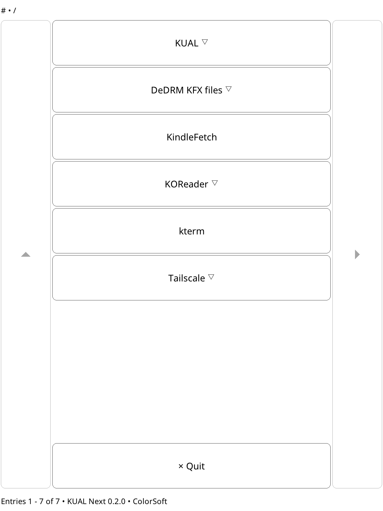

# KUAL Next

KUAL Next is a native launcher for existing KUAL JSON extensions on jailbroken
Kindles running hard-float firmware 5.16.3 or newer. It uses FBInk and Linux
evdev directly; Java, Kindlets, and Booklets are not required.



## Supported extension contract

The launcher scans `/mnt/us/extensions` for `config.xml` files and their JSON
menus. It supports nested `items`, actions and parameters, priorities, KUAL's
RPN `if` expressions, `exitmenu`, `checked`, `refresh`, `status`, `date`,
`hidden`, internal breadcrumb/status messages, collation, and relevant
`KUAL.cfg` discovery and sorting options.

Non-JSON menus, KUAL's Java mailbox/cache protocol, the old self-management
menu, TouchRunner output, and pre-hard-float firmware are intentionally out of
scope.

## Limitations compared with KUAL

| Area | Limitation |
| --- | --- |
| Display ownership | KUAL Next draws directly through FBInk and is not registered as a Kindle framework window. It suppresses the KPP status bar while visible and redraws after screen unlock, but unrelated framework windows may still repaint over it. |
| Legacy extensions | Only `config.xml` files referencing JSON menus are supported. Non-JSON menus and extensions requiring Java, Kindlet, or Booklet APIs do not work. |
| Dynamic menus | Menus are loaded at startup and after an item with `"refresh": true`; KUAL's cache and mailbox protocol for live menu updates is not implemented. |
| Command output | Actions run normally, but output is not presented in the launcher. TouchRunner-style output, progress displays, cancellation, and interactive terminal handling are unavailable. |
| Internal messages | Breadcrumb and status internal messages are currently both displayed in the bottom status area, rather than in separate areas as in KUAL. |
| Input | Touch, Home/Menu, back, next, and a small set of page-key aliases are supported. KUAL's numeric/QWERTY item shortcuts and Java focus navigation are not. |
| Configuration | Discovery depth, path exclusion, symlink following, collation, and `ABC`, `ABC!`, and `123` sorting are supported. UI settings such as `KUAL_no_show_status` and the self-management menu are not. |
| Parsing | `config.xml` is handled by the small, non-validating yxml parser. XML syntax, nesting, entities, CDATA, and processing instructions are supported; DTD validation and custom entity declarations are not. |
| Fonts | Bundled Noto fonts cover KUAL's standard indicators and many scripts and symbols, but there is no font fallback; unsupported characters may be rendered as squares. |
| Devices | Only recent ARM hard-float Kindles running firmware 5.16.3 or newer are targeted. Older ARMEL and keyboard-era devices are unsupported. |
| Menu size | Menus are limited to ten nesting levels and ten visible rows per page. |

## Tested extensions

- https://github.com/Satsuoni/DeDRM_tools/
- https://github.com/bfabiszewski/kterm
- https://github.com/koreader/koreader
- https://github.com/mitanshu7/tailscale_kual

## Native development and validation

Enter the pinned Nix environment and run the host tests:

```sh
nix develop
make test
```

Validate an extension tree without opening a framebuffer:

```sh
build/host/kual-next --validate --extensions /path/to/extensions --model KindlePaperWhite5
```

## Kindle cross-build

The one-time toolchain bootstrap downloads and builds
[koxtoolchain's](https://github.com/koreader/koxtoolchain) `kindlehf` target
into `.toolchains/`.

```sh
nix develop
make toolchain
make check
make package
```

The package is written to `dist/kual-next-<version>-kindlehf.zip`. Extract it
at the Kindle USB storage root so that `documents/KUAL Next.sh` and
`kual-next/bin/kual-next` land under `/mnt/us`. The scriptlet metadata uses the
bundled `kual-next/icon.png` as its Kindle library cover.

Runtime diagnostics are appended to `/var/tmp/kual-next.log`.
